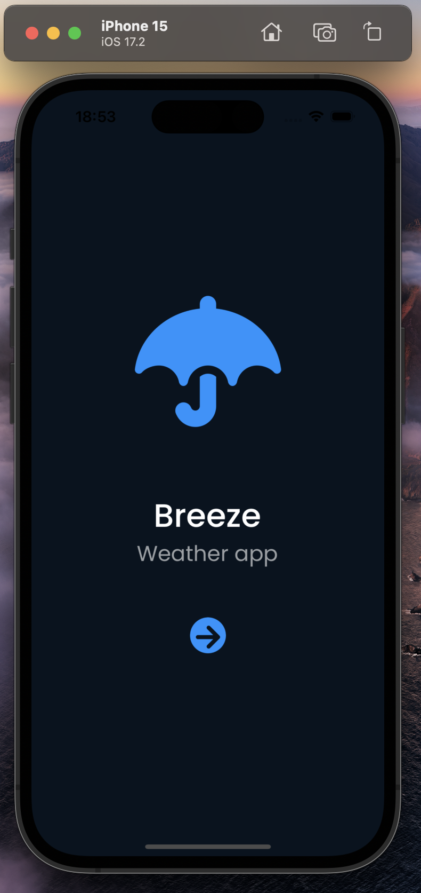
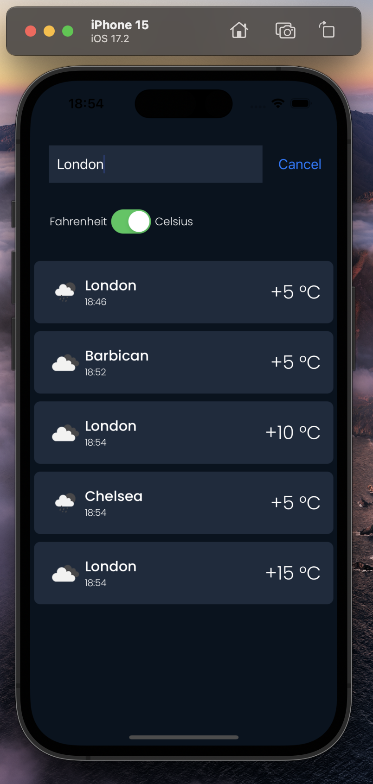
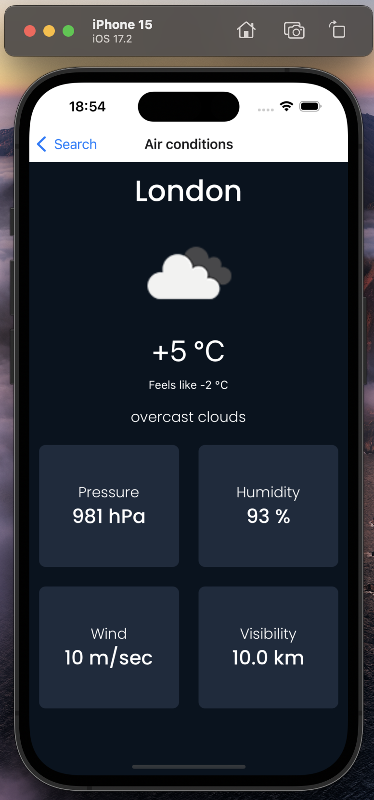

# Task Mobile App

This is a mobile application built with React Native and Expo.

## Table of Contents
- [Introduction](#introduction)
- [Key Features](#features)
- [Prerequisites](#prerequisites)
- [Installation](#installation)

## <a id="introduction"></a> Introduction 

Welcome to the Task Mobile App! This mobile application is a weather forecast tool built using React Native Expo, designed to provide real-time weather data for cities around the world. Leveraging the power of the [OpenWeatherMap API](https://openweathermap.org/), users can effortlessly stay informed about current weather conditions, including temperature, humidity, and general weather patterns.





### <a id="introduction"> </a>Key Features:

- **Real-time Weather Data:** Fetch and display current weather information for any specified city.
- **User-friendly Interface:** Enjoy a sleek and intuitive interface for easy navigation and interaction.
- **Celsius/Fahrenheit Toggle:** Toggle between Celsius and Fahrenheit units to suit personal preferences.
- **Responsive Design:** Experience a visually appealing and responsive design optimized for both Android and iOS devices.
- **Error Handling:** Robust error handling ensures smooth user experience even in edge cases and connectivity issues.


## <a id="prerequisites"></a> Prerequisites 

Ensure you have the following prerequisites installed:

- Node.js (> v.18)
- Expo CLI

## <a id="installation"></a> Installation

To get started, follow these steps:

```bash
$ git clone https://github.com/badjaaga/task-mobile-app.git
$ cd task-mobile-app
$ npm install
